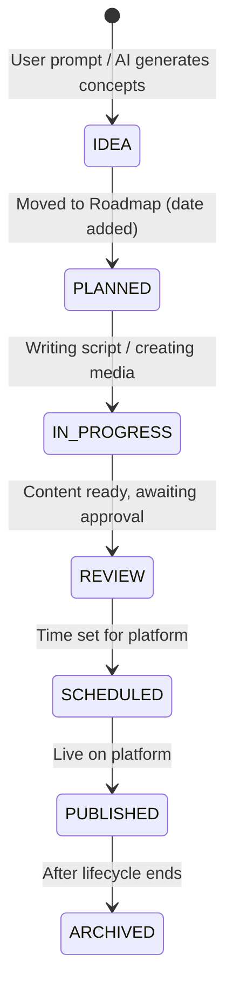

# CreatorKit COS - Project Workflow & Module Blueprint

This document translates the strategic blueprint into an actionable development workflow. It breaks down the project module by module and provides a step-by-step roadmap so you know exactly where to start and what to build next.

---

## 1. Module Overview & Priorities

Here is the refined list of modules you should focus on, based on the audit:

| Module | Status | Priority | Description |
| :--- | :--- | :--- | :--- |
| **AI Content Agent** | **NEW / P0** | Highest | The core feature. A text box where creators prompt ideas, and the AI generates titles, scripts, metadata, and schedules. |
| **Platform Connections** | **NEW / P0** | Highest | OAuth for YouTube (Phase 1) and others (Phase 2). Needed for the scheduler to work. |
| **Roadmap (Kanban)** | KEEP / P0 | Highest | Visual board for content planning (Idea → Planned → In Progress → Review → Scheduled). |
| **Dashboard** | REFINE / P1 | High | Entry point. Focus on quick actions (AI prompt box) and key stats. |
| **All Content / Library** | REFINE / P1 | High | Main list of content. *Drafts* should be merged here as a tab/filter. |
| **Scheduler** | REFINE / P1 | High | Calendar view to publish content to connected platforms. |
| **Analytics** | EXPAND / P2 | Medium | Metrics and insights for published content. |
| **Series Planner** | RENAME / P2 | Medium | Previously "Episode Planner". Generalize for any series. |
| **Media Library** | EXPAND / P2 | Medium | Store assets with AI tagging and background removal. |

> [!WARNING] Modules to Remove or Merge
> - **Brainstorming:** Remove. Move ideation directly into the AI Agent.
> - **Drafts:** Remove standalone page. Make it a filter inside the Content Library.
> - **3-Step "Add Content" Wizard:** Remove. Let the AI Agent handle content generation instead of manual data entry forms.

---

## 2. Development Phases (Where to Start)

Follow these phases sequentially to build the MVP effectively without getting overwhelmed.

### Phase 1: The Core Engine (Months 1-2)
**Goal:** Prove the core value — time from idea to scheduled post should be under 15 minutes.

1. **AI Content Agent (Basic)**
   - Build a simple UI: A text box ("What do you want to create today?").
   - Integrate OpenAI (GPT-4o/mini) or Claude to take the prompt and output: Title, Description, Tags, and Script Outline.
   - Automatically save the output to the Database (Content Library).
2. **Platform Integration (YouTube First)**
   - Implement OAuth 2.0 for YouTube.
   - Save the user's access/refresh tokens securely.
3. **Roadmap (Kanban Board)**
   - Build a drag-and-drop Kanban board.
   - Map content states: `IDEA` → `PLANNED` → `IN_PROGRESS` → `REVIEW` → `SCHEDULED`.
4. **Basic Scheduler**
   - Allow users to take a piece of content, pick a date/time, and queue it for YouTube publishing.

### Phase 2: Agent Automation & Polish (Months 3-5)
**Goal:** Make the AI smarter and connect the workflows.

1. **Multi-Step AI Agent Pipeline**
   - Implement an async job queue (e.g., BullMQ + Redis).
   - Break AI tasks into steps: Intent Parsing → Script Generation → Metadata → Thumbnail Prompt.
   - Add Server-Sent Events (SSE) to show users real-time generation progress.
2. **Series Generation**
   - Update the AI to handle series requests (e.g., "5-part YouTube series on fitness") and auto-generate 5 distinct content cards.
3. **Content Scoring**
   - Add AI validation to score hooks and SEO before publishing.

### Phase 3: Intelligence & Multi-Platform (Months 6-9)
**Goal:** Scale to multiple platforms and provide smart insights.

1. **More Platforms**
   - Add Instagram and TikTok OAuth & Publishing APIs.
2. **Best Time to Post**
   - Build a logic engine to suggest the optimal posting time based on platform rules and historical data.
3. **Analytics Dashboard**
   - Pull views, likes, and comments from YouTube/IG APIs.
   - Show cross-platform performance comparisons.

---

## 3. Module Implementation Steps (Your To-Do List)

When you sit down to code, follow these exact steps for the major modules.

### A. The AI Agent Module (Start Here)
- [ ] Create `POST /api/ai/generate` route.
- [ ] Write the `IntentParserService` to extract topic/platform from user text.
- [ ] Write prompts for `TitleGeneratorService` and `ScriptWriterService`.
- [ ] Create the Frontend UI for the Agent (chat/prompt box).
- [ ] Ensure generated data saves correctly to the `content_items` MongoDB collection.

### B. YouTube Integration Module
- [ ] Set up a Google Cloud Console project and enable YouTube Data API v3.
- [ ] Create `POST /api/auth/platform/youtube` to handle the OAuth flow.
- [ ] Store tokens in the `platform_connections` collection.
- [ ] Create a worker (BullMQ) to handle publishing scheduled posts via YouTube API.

### C. Roadmap & Content Management Module
- [ ] Create the MongoDB schema for `roadmap_cards` and `content_items`.
- [ ] Build the `GET /api/roadmap` route to fetch all items for a user.
- [ ] Build the frontend Kanban board.
- [ ] Implement drag-and-drop state updates (`PUT /api/content/:id/status`).

---

## 4. The Content State Machine

Every piece of content flows through this exact lifecycle. Ensure your database and UI reflect these states:

## Summary of Your Next Immediate Action:
1. Open your code editor.
2. Begin building the **AI Content Agent pipeline** (Phase 1). Start by writing the backend routes to accept a user prompt and call OpenAI/Claude to return structured JSON (Title, Tags, Script).
3. Then, build the UI for the user to input this prompt and view the results.
